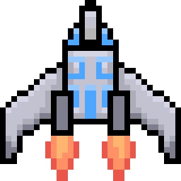

- [Celestial career - working name](#celestial-career---working-name)
  - [Levels](#levels)
    - [Miranda system](#miranda-system)
      - [Harsh landing](#harsh-landing)
      - [Takeoff](#takeoff)
      - [Miranda system](#miranda-system-1)
      - [Lurking danger](#lurking-danger)
      - [The Gatekeeper](#the-gatekeeper)
    - [Dyrriani system](#dyrriani-system)
      - [SPAT](#spat)
      - [Graveyards of Dyrriani](#graveyards-of-dyrriani)
      - [Hot fusion](#hot-fusion)
      - [Hail Mary](#hail-mary)
    - [Heliantus system](#heliantus-system)
      - [Taraxacum 4B](#taraxacum-4b)
      - [Heliantus United](#heliantus-united)
      - [Calendula arvensis](#calendula-arvensis)
      - [Borealis recovery](#borealis-recovery)
      - [Adrift between the stars](#adrift-between-the-stars)
    - [Salvadoran system](#salvadoran-system)
      - [Another sun](#another-sun)
      - [Salvadoran system](#salvadoran-system-1)
      - [Celestial stability](#celestial-stability)
      - [Salvadoran system II - Finale](#salvadoran-system-ii---finale)
  - [Ships](#ships)
    - [Miranda](#miranda)
      - [Shuttle](#shuttle)
    - [Dyrriani](#dyrriani)
      - [Fragment](#fragment)
    - [Heliantus](#heliantus)
      - [Freighter - working name](#freighter---working-name)
      - [Ghost - working name](#ghost---working-name)
    - [Salvadoran](#salvadoran)
      - [Second Sol](#second-sol)

## name ideas
[common to latin plant names](https://planterschoice.com/ask-the-experts/index-of-common-names-common-to-latin/)

- Celestial career
- Salvadoran career
- Starventure

# Celestial career - working name

## Levels

### Miranda system
*Tutorial*
- green system color

#### Harsh landing
- flight introduction
  - first short flight, controls (dodging a few asteroids)

#### Takeoff
- module system introduction
  - first modules (first weapon - legacy laser?)

#### Miranda system
- unlocking introduction (new engine - story-wise powerful enough to warp into new systems)

#### Lurking danger
- enemy introduction
  - different enemies than just asteroids (maybe minefield?)

#### The Gatekeeper
- boss introduction
  - miniboss at the end of the Miranda system

### Dyrriani system
*Midgame, upgrades*
- red system color

#### SPAT
- space pirates

#### Graveyards of Dyrriani
- pirate-like ship unlock ("Marigold"?)
  - scrap/makeshift appearance?
  - relies mostly on modules to work
  - heavily modifiable (more slots; more universal slots)

#### Hot fusion
- long big pirate faction (SPAT) fight

#### Hail Mary
- warp out of Dyrriani

### Heliantus system
*Endgame preparation*
- blue system color

#### Taraxacum 4B
- actual name of the star btw, but the corp was so rich and well known, it was known as Heliantus instead

#### Heliantus United
- level rich in modules/resources
- story-wise an abandoned orbital factory planet
- teal system color

#### Calendula arvensis
- endgame pirate ambush with a bossfight in the same level
- "moon pirates"
- Ghost-like ship unlock

#### Borealis recovery
- a hiding game
  - scanning enemies which one-shot you and cant be destroyed, only avoided using the ghost's cloaking device

#### Adrift between the stars
- warp out of Heliantus

### Salvadoran system
*Endgame*
- yellow system color

#### Another sun
- new endgame ship unlock "Second Sol"
  - single powerful laser slot
  - slow and heavy

#### Salvadoran system

#### Celestial stability
- purple system color

#### Salvadoran system II - Finale

## Ships

### Miranda
*Ships unlocked from the start*

#### Shuttle

### Dyrriani
*Pirate inspired / war ships*

#### Fragment

- highly modular
- almost fully dependent on modules
- SPAT themed (*Wing pirates from my cosmoteer? XD*)

### Heliantus
*Modular, industrial, advanced ships*

#### Freighter - working name

- heavy modular freighter-like ship

#### Ghost - working name

- fast, cloaking ship (similar to runner)
- only a few modules, strong engine and cloaking module, weak weapons

### Salvadoran
*Powerful specialized endgame ships*

#### Second Sol

- one single powerful core laser